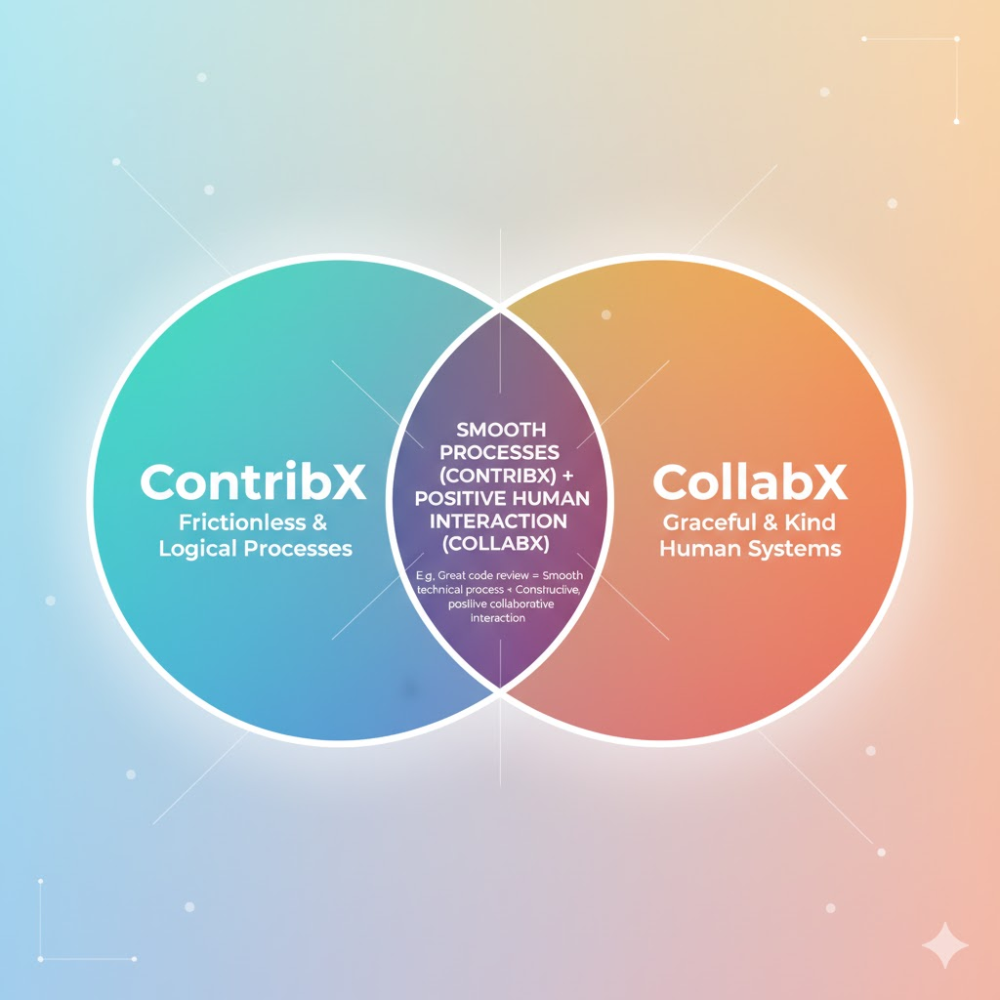

# Understanding Collaborative Experience (CollabX) and Contributor Experience (ContribX)

By: Karsten Wade, October 2025

The concepts of Collaborative Experience (CollabX) and Contributor Experience (ContribX) offer a granular framework for understanding and improving how humans work together to create something. While these concepts are essentially core pillars of Developer Experience (DevEx), they fundamentally address the dynamics involved in any creative or constructive endeavor where people gather to create an artifact or service. They move beyond the surface of high-level buzzwords to provide a structured diagnostic tool for analyzing friction points.

CollabX and ContribX are defined as two distinct, yet deeply intertwined, dynamic domains of experience.

### Collaborative Experience (CollabX)

Collaborative Experience (CollabX) is centered on the purely human-to-human dynamics of a working group of people. It is the set of experiences, factors, conditions, and practices an individual undergoes when attempting to and conducting work with other people.

CollabX focuses on the soft, often difficult-to-quantify, aspects of team interaction and communication. A great CollabX is what motivates individuals to work with their team, while a poor one can cause frustration, such as dreading meeting invitations.

#### Core Elements of CollabX:

Human Dynamics and Interactions — CollabX covers the actual human interactions within a team or community. Key questions include:

Do people feel psychologically safe enough to ask questions?

Is communication clear and respectful?

How effective are the communication mediums used (e.g., asynchronous chat platforms like Slack)? Does the medium get in the way or deter communication?

Sense of Belonging and Fairness — CollabX covers critical human elements that are difficult to measure, such as an individual's sense of belonging. It evaluates whether people feel they are being treated fairly and equitably, and contributes to a sense of general happiness.

Relationship to UX  —  The Collaborative Experience is comparable to User Experience (UX), emphasizing the holistic experience of interacting with a system or product (in this case, the product is the social structure and team culture). It should focus on whether the experience is a "joy and delight".

### Contributor Experience (ContribX)

Contributor Experience (ContribX) is focused on the human-to-system experience. It is the experience of interacting with the infrastructure required to produce the desired artifact, such as the tools, the codebase, or the deployment pipeline.

ContribX is defined as the set of experiences, factors, and conditions an individual undergoes when deliberately attempting to contribute an idea or an artifact (like content, code, or scientific papers) to a project. It covers the whole experience of getting work done and having it integrated.

#### Core Elements of ContribX

Tooling and Friction Reduction — ContribX assesses whether the tools and processes are a powerful accelerator or a frustrating roadblock. This involves focusing on reducing cognitive load, which is the mental baggage caused by confusing or complex processes. Examples include:

Can a new contributor get set up in an hour, or does it take a whole week?

Is the documentation actually helpful and clear?

Integration and Feedback Loops — ContribX examines the speed and ease with which a contribution is accepted and integrated. This ties into the concept of feedback loops, where developers need speed and clarity to know if their work is sound. Friction points—such as a pull request sitting in an approval queue for two days—severely impact satisfaction, regardless of positive team morale.

Meaning and Worthwhileness — ContribX also encompasses the experience of receiving recognition for the work. Crucially, it involves the individual's sense of whether the work contributed has meaning and the sense of worthwhileness of the time spent. Two key measures of a great contribution experience are the time required for a new person to make their first contribution and then time required to make their first valuable contribution, as this fosters a scalable feeling of empowerment — the faster to the second experience, the faster the scaling-up of empowerment (typically).

Comparable to CollabX’s sense of belonging, ContribX has a sense of equity, that is, does a contributor perceive through their work a feeling and/or fact of involvement and ownership toward the whole. Are ideas listened to? Can a contributor see the effects of their work in the quality and worthiness of the whole?

Relationship to DevEx — ContribX is the domain that shares the most crossover with the existing understanding of Developer Experience (DevEx), which is fundamentally the user experience from a developer’s point of view, encompassing their interaction with tools, processes, and culture.

### The Intertwined Relationship and Broader Applicability

CollabX and ContribX are distinct, yet deeply intertwined, and are not in a hierarchy where one is more important than the other. They are best conceptualized as two overlapping circles in a Venn diagram.

The overlap represents instances where smooth processes (ContribX) meet positive human interaction (CollabX). For example, a great code review requires both a smooth technical process and a constructive, positive collaborative interaction.

#### Diagnostic Power and Contextual Role

The separation of these two concepts provides a powerful diagnostic tool. When a project or team struggles, the framework allows leaders to ask a more precise question: "Is this a collab problem or a contrib problem?". This allows the focus to shift from general frustration to solving the correct issue, such as determining if engineers are frustrated with the tooling (ContribX) or with each other (CollabX).

In the context of software development, collaboration is considered a multiplier across the entire DevEx. Improving collaboration inevitably improves the overall developer experience, although changes must be monitored to ensure an intervention to improve one area (e.g., cutting meetings) does not inadvertently degrade the other (collaboration).

#### Application Beyond Software Development

Although CollabX and ContribX as presented here are heavily grounded in the context of DevEx, the core definitions support their application to any creative or constructive endeavor.

CollabX inherently addresses the human element—the culture, safety, and communication—that is necessary for any group, regardless of the output (e.g., assessing the sense of belonging and communication clarity in a community garden planning meeting).

ContribX deals with contributing one or more parts of an artifact to a project run by a community as an intellectual property commons. This definition scope explicitly includes scientific contributions and artifacts like papers. By focusing on the experience of receiving recognition, minimizing friction, and clarifying documentation, ContribX applies wherever people are contributing effort and material to a shared system (e.g., the onboarding and setup process for contributing to an open source project’s documentation or the clarity of instructions for building a shared structure such as a workshop/barn).